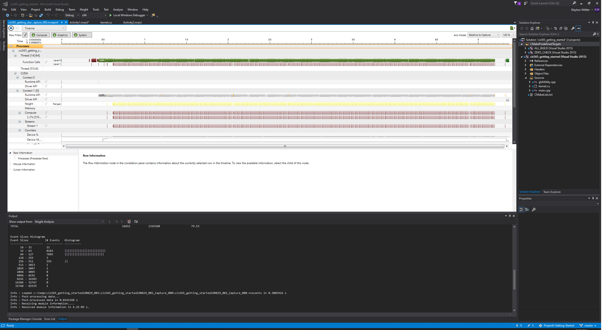

Project 0 Getting Started
====================

**University of Pennsylvania, CIS 565: GPU Programming and Architecture, Project 0**

* Klayton Wittler
  * [LinkedIn](https://www.linkedin.com/in/klayton-wittler/)
* Tested on: Windows 10 Pro, i7-7700K @ 4.20GHz 16.0GB, GTX 1070 8.192GB (my PC)

## WebGL support

## DXR support

## Build and Run: getting-started

## Analysis

## Nsight Debugging
index is set to 4200 

